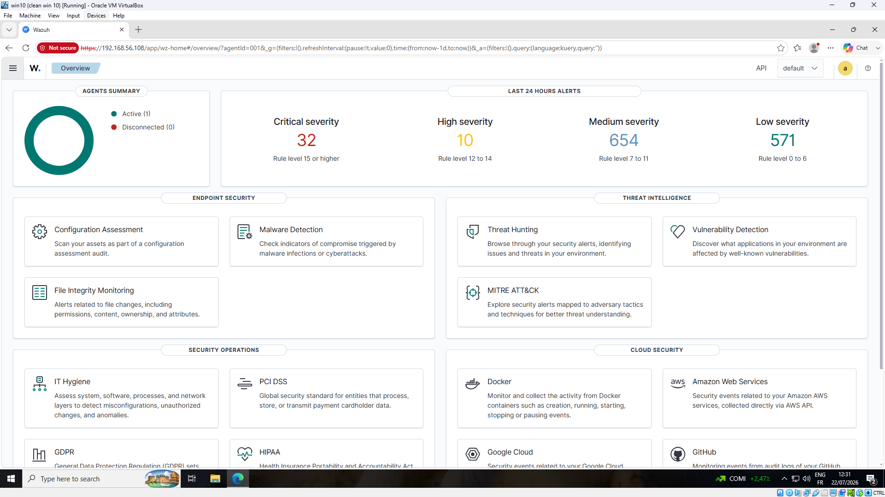
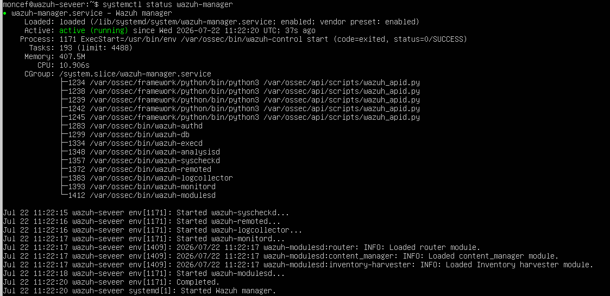
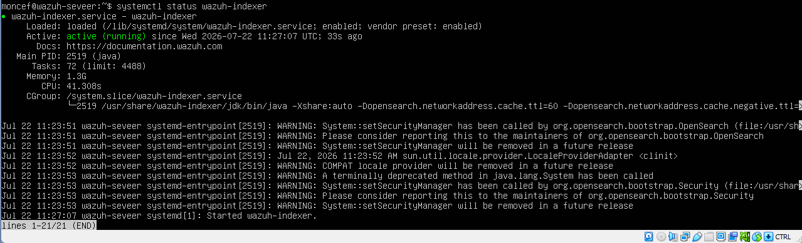
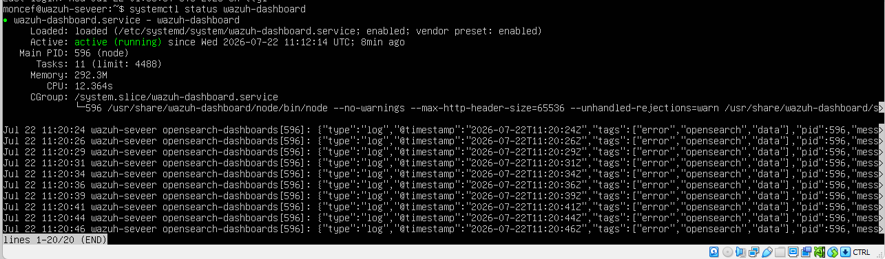

# Lab 01 - Wazuh Installation

## Overview

**Date:** 22 July 2026

**Author:** messaoudi moncef

## Objective

The objective of this lab was to deploy a single-node Wazuh SIEM server on Ubuntu Server using the official quick install script, establishing the foundation for the rest of the home SOC lab.

---

## Lab Environment

| Component    | Description        |
| ------------ | ------------------ |
| SIEM         | Wazuh               |
| Wazuh Server | Ubuntu Server        |
| Hypervisor   | Oracle VirtualBox   |

---

## Network Configuration

| Device       | IP Address     |
| ------------ | -------------- |
| Wazuh Server | 192.168.56.108 |

---

## Installation Steps

Wazuh was installed on the Ubuntu Server VM using the official all-in-one quick install script, which deploys the Wazuh indexer, manager, and dashboard components on a single node.

The following command was used to download and run the installation script:

```bash
curl -sO https://packages.wazuh.com/4.x/wazuh-install.sh && sudo bash ./wazuh-install.sh -a
```

Once the installation completed, the script generated admin credentials for accessing the Wazuh dashboard. These were saved securely for future logins.

The Wazuh dashboard was then accessed from a browser at:
https://192.168.56.108

The default self-signed certificate warning was accepted to proceed to the login page, and the generated admin credentials were used to log in successfully.

## Verification

To confirm that all Wazuh services were running correctly, the status of each core component was checked individually on the Wazuh server:

```bash
systemctl status wazuh-manager
systemctl status wazuh-indexer
systemctl status wazuh-dashboard
```

All three services reported an **active (running)** status, confirming a successful installation.

---

### Figure 1 – Wazuh Dashboard Login Page

The Wazuh login page was successfully reached over HTTPS at `192.168.56.108`, confirming the dashboard component was installed and reachable from the network.


---

### Figure 2 – Wazuh Dashboard Overview

After logging in, the Wazuh dashboard overview confirmed an active agent connection and displayed alert summaries by severity, verifying the manager, indexer, and dashboard were fully integrated and processing events.



---

### Figure 3 – Wazuh Manager Service Status

The `systemctl status wazuh-manager` command confirmed the manager service was active and running, with core processes such as wazuh-analysisd, wazuh-remoted, and wazuh-syscheckd successfully started.



---

### Figure 4 – Wazuh Indexer Service Status

The `systemctl status wazuh-indexer` command confirmed the indexer service was active and running, responsible for storing and indexing the security events collected by the manager.



---

### Figure 5 – Wazuh Dashboard Service Status

The `systemctl status wazuh-dashboard` command confirmed the dashboard service was active and running, providing the web interface used to visualize and investigate security events.



---

## Analysis / Findings

The quick install script simplified deployment significantly by handling the installation and configuration of the indexer, manager, and dashboard in a single automated process. This provided a fast path to a working SIEM environment suitable for a home lab, though in a production environment a distributed multi-node deployment would typically be used for scalability and resilience.

Verifying all three services independently and confirming successful dashboard access with an active agent connection showed the Wazuh server was fully operational and ready to collect security events for the subsequent labs.

## Conclusion

This lab established the core SIEM platform used throughout the rest of the home SOC lab. Deploying Wazuh using the quick install script provided a working single-node environment, verified through service status checks on the manager, indexer, and dashboard, as well as successful dashboard login and agent visibility. This foundation enabled endpoint enrollment and log collection in the labs that followed.
