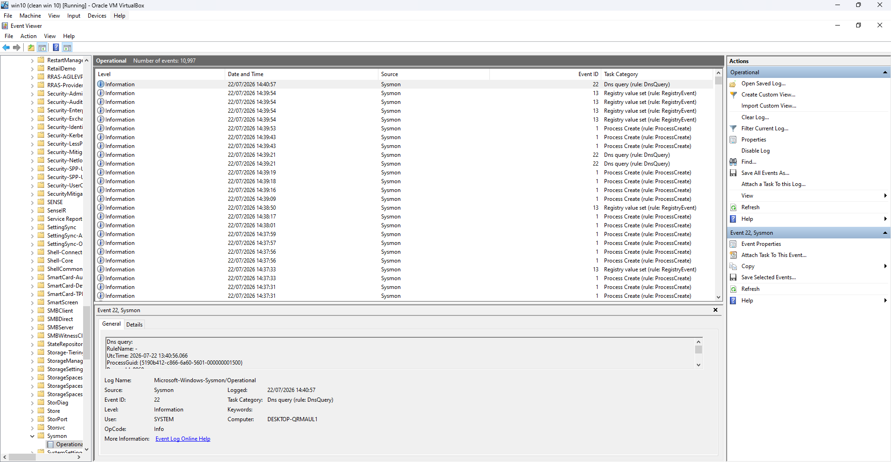
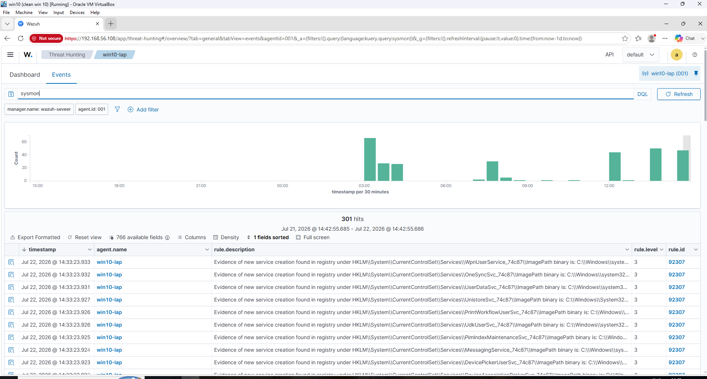

# Lab 02 - Sysmon Integration

## Overview

**Date:** 22 July 2026

**Author:** messaoudi moncef

## Objective

The objective of this lab was to install and configure Sysmon on the Windows 10 endpoint using the SwiftOnSecurity configuration, and verify that the enriched event logs were successfully collected and forwarded to Wazuh.

---

## Lab Environment

| Component    | Description                     |
| ------------ | -------------------------------- |
| SIEM         | Wazuh 4.12.0                     |
| Wazuh Server | Ubuntu Server 22.04.5 LTS        |
| Endpoint     | Windows 10 Pro 22H2              |
| Hypervisor   | Oracle VirtualBox                |
| Logging      | Sysmon 15.15 (SwiftOnSecurity config) |
---

## Network Configuration

| Device       | IP Address     |
| ------------ | -------------- |
| Wazuh Server | 192.168.56.108 |
| Windows 10   | 192.168.56.107 |

---

## Installation Steps

Sysmon was installed on the Windows 10 endpoint using Microsoft Sysinternals' Sysmon utility, configured with the community-maintained **SwiftOnSecurity** configuration file, which provides a well-tuned baseline for detecting common attacker techniques while minimizing log noise.

The Sysmon binary and the SwiftOnSecurity config were downloaded to the endpoint:

- Sysmon: https://learn.microsoft.com/en-us/sysinternals/downloads/sysmon
- Config: https://github.com/SwiftOnSecurity/sysmon-config

Sysmon was then installed and configured using the following command from an elevated command prompt:

```powershell
sysmon64.exe -accepteula -i sysmonconfig-export.xml
```

This installed Sysmon as a Windows service and applied the SwiftOnSecurity ruleset, which defines which event types (process creation, network connections, image loads, etc.) are logged and which are filtered out.

## Wazuh Agent Configuration

To forward Sysmon events to the Wazuh manager, the Wazuh agent's configuration file (`ossec.conf`) on the Windows endpoint was updated to include the Sysmon event log channel:

```xml
<localfile>
  <location>Microsoft-Windows-Sysmon/Operational</location>
  <log_format>eventchannel</log_format>
</localfile>
```

The Wazuh agent service was then restarted to apply the change:

```powershell
Restart-Service -Name WazuhSvc
```

## Verification

To confirm Sysmon was generating events locally, Windows Event Viewer was checked under:
Applications and Services Logs → Microsoft → Windows → Sysmon → Operational

Sysmon events spanning multiple types — including Event ID 1 (Process Creation), Event ID 13 (Registry Value Set), and Event ID 22 (DNS Query) — were visible, confirming the service was actively logging a broad range of activity.
To confirm the events were reaching Wazuh, the Wazuh dashboard's **Threat Hunting** module was checked, filtering by the Windows 10 agent. Sysmon-sourced events appeared alongside standard Windows Security events, confirming successful log forwarding.

---
## Result

Sysmon was successfully installed on the Windows endpoint and configured using the SwiftOnSecurity ruleset. After updating the Wazuh agent configuration, Sysmon Operational logs were successfully forwarded to the Wazuh Manager and became available for threat hunting and future detection exercises.

---

### Figure 1 – Sysmon Installed and Running

Windows Event Viewer confirmed that Sysmon was installed and actively logging under `Microsoft-Windows-Sysmon/Operational`, with 10,997 events recorded, including process creation, registry value changes, and DNS query events.



---

### Figure 2 – Sysmon Events in Wazuh Dashboard

The Wazuh Threat Hunting module, filtered by the `win10-lap` agent and a `sysmon` search query, returned 301 hits over the past 24 hours, confirming that Sysmon telemetry was being successfully forwarded and indexed by Wazuh. The results included service creation events (Rule ID 92307) detected in the Windows registry.



---

## Analysis / Findings

Integrating Sysmon significantly increased the visibility available for detection compared to relying on default Windows Security logs alone. The SwiftOnSecurity configuration in particular provided detailed process creation, network connection, and image load events while filtering out high-noise, low-value events — a practical balance for a home lab with limited storage and processing resources.

This enriched telemetry lays the groundwork for more advanced detections in later labs, such as identifying suspicious process chains, unusual network connections, or living-off-the-land binary abuse, which are difficult or impossible to detect using standard Windows Security logs alone.

## Conclusion

This lab extended the Wazuh SIEM deployed in Lab 01 by adding Sysmon telemetry to the Windows 10 endpoint. Using the SwiftOnSecurity configuration provided a strong out-of-the-box baseline for process, network, and file event visibility. Verifying event generation locally and confirming successful forwarding to Wazuh established the enhanced logging pipeline needed for the detection-focused labs that follow.
