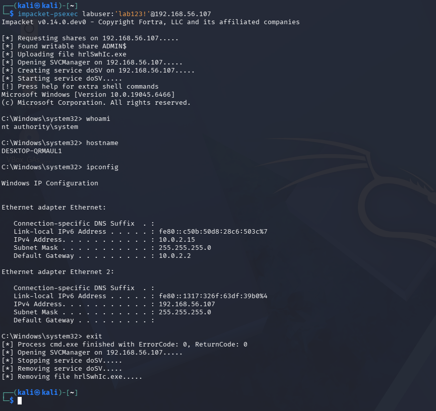
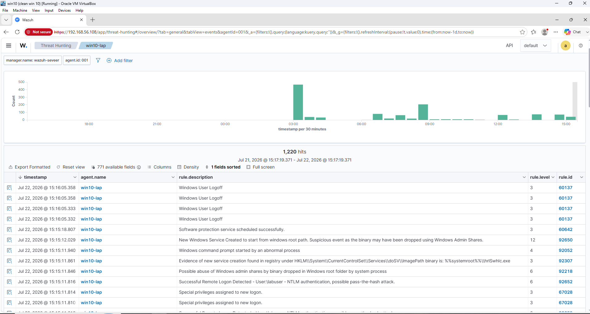

# Lab 04 - PsExec Execution Detection

## Overview

**Date:** 22 July 2026

**Author:** messaoudi moncef

## Objective

The objective of this lab was to simulate a PsExec-style lateral movement attack against the Windows 10 endpoint using Impacket's `psexec.py`, and verify that Wazuh detected and correlated the full attack chain — from SMB authentication through remote service execution to cleanup.

---

## Lab Environment

| Component    | Description                     |
| ------------ | -------------------------------- |
| SIEM         | Wazuh 4.12.0                     |
| Wazuh Server | Ubuntu Server 22.04.5 LTS        |
| Endpoint     | Windows 10 Pro 22H2              |
| Attacker     | Kali Linux                       |
| Hypervisor   | Oracle VirtualBox                |
| Logging      | Windows Security Logs + Sysmon (SwiftOnSecurity config) |

---

## Network Configuration

| Device       | IP Address     |
| ------------ | -------------- |
| Wazuh Server | 192.168.56.108 |
| Windows 10   | 192.168.56.107 |
| Kali Linux   | 192.168.56.103 |

---

## Attack Scenario

Impacket's `psexec.py` was used from the Kali Linux attacker machine to authenticate to the Windows 10 endpoint using the **labuser** account and execute a remote SYSTEM-level shell — the same technique used by legitimate admins and by real attackers performing lateral movement once valid credentials are obtained.

Before running the attack, Windows Defender real-time protection was disabled on the endpoint to prevent AV interference, and the `LocalAccountTokenFilterPolicy` registry value was set to allow the local `labuser` account to authenticate remotely with full administrative rights, since UAC remote restrictions block local (non-domain) accounts by default.

This simulation represents how an attacker with valid credentials could pivot to remote code execution over SMB, and how a SOC would detect and reconstruct this activity using SIEM correlation.

**MITRE ATT&CK:** T1021.002 – SMB/Windows Admin Shares, T1569.002 – System Services: Service Execution

---

## Attack Simulation

The following command was run from Kali Linux to authenticate and execute a remote shell:

```bash
impacket-psexec labuser:'lab123!'@192.168.56.107
```

Impacket authenticated to the `ADMIN$` share, uploaded a temporary service binary (`hrlSwhIc.exe`), created and started a Windows service (`doSV`) to execute it, and returned an interactive SYSTEM-level shell:

[*] Found writable share ADMIN$
[*] Uploading file hrlSwhIc.exe
[*] Opening SVCManager...
[*] Creating service doSV...

From the resulting shell, running as `nt authority\system`, basic reconnaissance commands were executed to simulate post-exploitation activity:

```cmd
whoami
hostname
ipconfig
```

Upon exiting the session, Impacket automatically cleaned up after itself — stopping and removing the service, and deleting the uploaded binary:

[] Stopping service doSV.....
[] Removing service doSV.....
[*] Removing file hrlSwhIc.exe.....

---

## Detection Logic

The Wazuh Threat Hunting module, filtered by the `win10-lap` agent, showed 1,220 hits over the attack window. Several distinct rules fired, together reconstructing the full attack chain:

| Rule ID | Level | Description |
|---------|-------|-------------|
| 92652 | 6 | Successful Remote Logon Detected – NTLM authentication, possible pass-the-hash attack |
| 67028 | 3 | Special privileges assigned to new logon |
| 92307 | 3 | Evidence of new service creation found in registry (`hrlSwhIc.exe`) |
| 92650 | 12 | New Windows service created to start from Windows root path — suspicious, binary may have been dropped via admin shares |
| 92218 | 6 | Possible abuse of Windows admin shares by binary dropped in Windows root folder by system process |
| 92052 | 4 | Windows command prompt started by an abnormal process |
| 60137 | 3 | Windows User Logoff |

Rule 92650, at severity level 12, was the highest-fidelity alert — Wazuh's built-in ruleset specifically flagged the pattern of a service being created to launch a binary dropped via an admin share, which is a strong behavioral indicator of PsExec-style tooling rather than legitimate software installation.

---

### Figure 1 – Impacket PsExec Execution from Kali

The Kali terminal shows `impacket-psexec` successfully authenticating to the `ADMIN$` share, uploading a service binary, and returning a SYSTEM-level shell on the Windows 10 endpoint. Commands such as `whoami` confirm execution as `nt authority\system`, and the session cleanup (service and file removal) is visible on exit.



---

### Figure 2 – Wazuh Detection Timeline

The Wazuh Threat Hunting module displays the full sequence of alerts generated by the attack — from the NTLM remote logon and privilege assignment, through suspicious service creation and admin share abuse, to the final logoff — demonstrating end-to-end visibility into the attack chain.



---

## Attack Timeline

1. NTLM authentication
2. Privileged logon
3. Service binary uploaded
4. Windows service created
5. SYSTEM shell obtained
6. Commands executed
7. Service removed
8. User logoff

---

## Analysis / Findings

This lab demonstrated a clear escalation in detection value compared to Lab 03. While the SMB authentication lab showed a single successful logon event, this PsExec simulation triggered a full chain of correlated alerts spanning authentication, privilege assignment, service creation, and abnormal process execution — giving a much richer picture of attacker activity.

Rule 92650 in particular stood out as a high-confidence detection, since it specifically targets the behavioral pattern of a service being created to execute a binary dropped via an admin share — a strong, low-false-positive indicator of PsExec-style tooling rather than something a signature-based tool would need to catch via known malware hashes.

From a SOC analyst's perspective, this alert chain would immediately warrant escalation. The combination of NTLM authentication flagged as a possible pass-the-hash attempt (Rule 92652), followed within seconds by suspicious service creation (Rule 92650) and admin share abuse (Rule 92218), forms a textbook lateral movement pattern that should not require deep manual correlation to recognize — the rule chain tells the story on its own.

## Detection Gaps & Improvements

- **Response automation:** These alerts would be strong candidates for an active response rule in Wazuh to automatically disable the account or isolate the host when Rule 92650 or 92218 fire together within a short time window.
- **Baseline tuning:** In an environment with legitimate remote administration tools (e.g., SCCM, PDQ Deploy), rule 92650 would need tuning or allowlisting to avoid false positives from expected admin share usage.
- **Defender re-enablement:** Since Defender was disabled to run this simulation, a follow-up lab could test whether Wazuh alone (without AV) is sufficient to catch this activity in near real-time, or whether AV/EDR integration is needed to block rather than just detect.

## Conclusion

This lab simulated a realistic lateral movement scenario using Impacket's PsExec implementation and confirmed that Wazuh's built-in ruleset was able to detect and correlate the full attack chain without any custom rule authoring. The high-severity service creation alert (Rule 92650) combined with the admin share abuse and pass-the-hash indicators demonstrated strong out-of-the-box detection coverage for a well-known lateral movement technique, reinforcing the value of the Sysmon and Windows Security logging pipeline established in the earlier labs.
