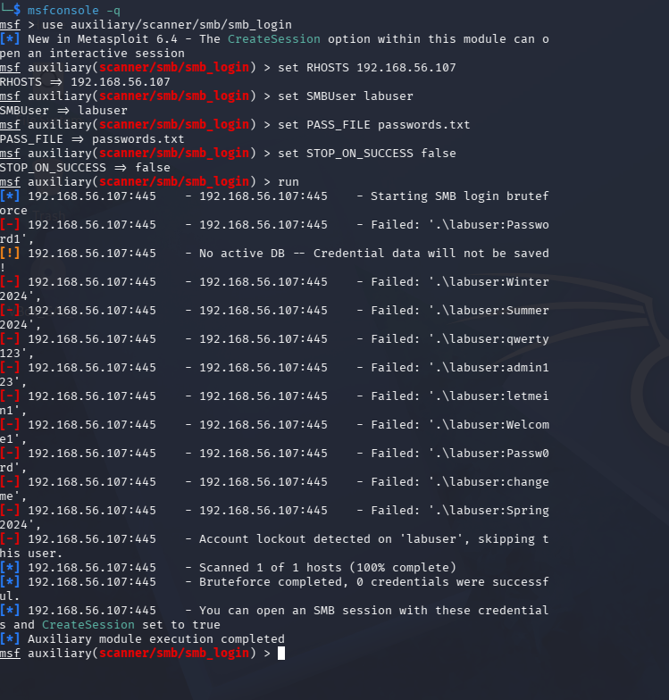
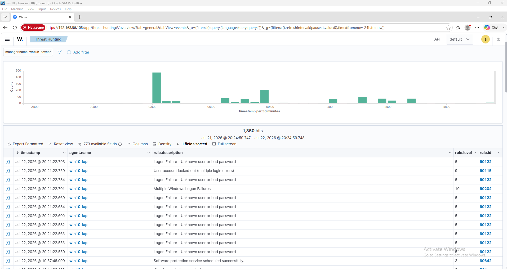
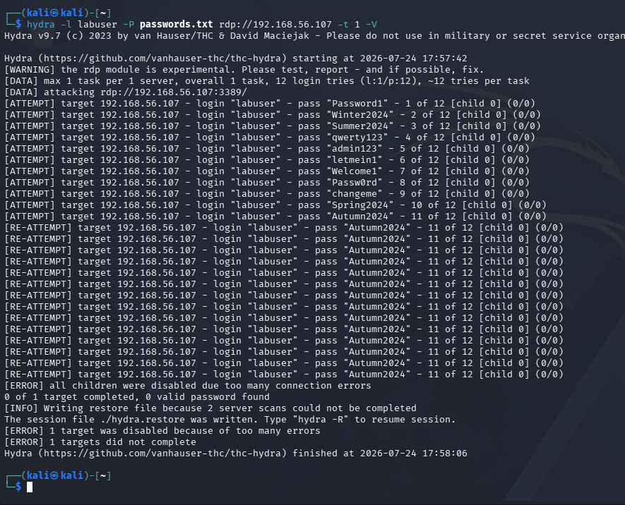
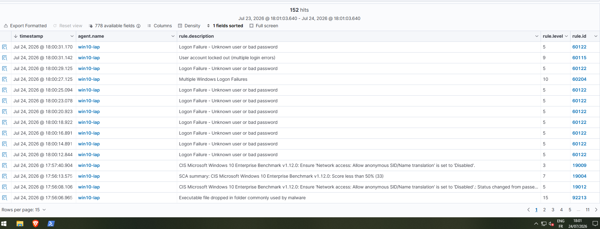

# Lab 05 - Brute Force Detection and Active Response

## Overview

**Date:** 22–24 July 2026

**Author:** messaoudi moncef

## Objective

The objective of this lab was to simulate brute force authentication attacks against the Windows 10 endpoint from Kali Linux, verify that Wazuh's built-in frequency correlation rules detected the activity, and configure Wazuh's **Active Response** module to automatically block the attacking host once the detection threshold was crossed. In the process, this lab uncovered and documented a real limitation in IP-based automated response for this environment.

---

## Lab Environment

| Component    | Description                                             |
| ------------ | --------------------------------------------------------- |
| SIEM         | Wazuh 4.12.0                                             |
| Wazuh Server | Ubuntu Server 22.04.5 LTS                                |
| Endpoint     | Windows 10 Pro 22H2                                      |
| Attacker     | Kali Linux                                               |
| Hypervisor   | Oracle VirtualBox                                        |
| Logging      | Windows Security Logs + Sysmon (SwiftOnSecurity config)  |

---

## Network Configuration

| Device       | IP Address     |
| ------------ | -------------- |
| Wazuh Server | 192.168.56.108 |
| Windows 10   | 192.168.56.107 |
| Kali Linux   | 192.168.56.103 |

---

## Attack Scenario

Two brute force simulations were performed against the local **labuser** account on the Windows 10 endpoint, using two different protocols, to test both detection and automated response:

1. **SMB** — using Metasploit's `smb_login` module with a password list
2. **RDP** — using Hydra, after the SMB test revealed a limitation that needed to be re-tested against a different protocol

Each failed authentication attempt generates a Windows **Security Event ID 4625** (An account failed to log on), which the Wazuh agent forwards to the manager. Wazuh's frequency correlation engine groups these failures and, once a threshold is crossed, fires **Rule 60204 — "Multiple Windows Logon Failures"** (Level 10).

The goal was to configure Active Response so this detection would trigger an automatic block of the attacking host — moving from passive alerting to automated containment.

**MITRE ATT&CK:** T1110.001 – Brute Force: Password Guessing

---

## Attack Simulation — Phase 1: SMB (Metasploit)

```bash
msfconsole -q
use auxiliary/scanner/smb/smb_login
set RHOSTS 192.168.56.107
set SMBUser labuser
set PASS_FILE passwords.txt
set STOP_ON_SUCCESS false
run
```

Metasploit iterated through the password list, generating multiple failed authentication attempts. Before it reached the correct password, Windows' own native account lockout policy triggered and disabled further attempts:
[-] Account lockout detected on 'labuser', skipping this user.
[*] Bruteforce completed, 0 credentials were successful.

### Figure 1 – Metasploit SMB Brute Force

The Metasploit `smb_login` module iterated through multiple candidate passwords against `labuser`. Windows' native account lockout policy triggered partway through the wordlist, blocking further attempts before Metasploit reached the valid credential.



---

## Detection Logic — Phase 1 (SMB)

The Wazuh Threat Hunting module, filtered by the `win10-lap` agent, showed the following rules fire in sequence during the SMB brute force:

| Rule ID | Level | Description |
|---------|-------|-------------|
| 60122 | 5 | Logon Failure – Unknown user or bad password |
| 60115 | 9 | User account locked out (multiple login errors) |
| 60204 | 10 | Multiple Windows Logon Failures |

Rule 60204 — Wazuh's built-in frequency-based correlation rule — fired correctly with no custom rule authoring required, confirming detection worked as expected for SMB/NTLM authentication failures.

### Figure 2 – Wazuh Detection: SMB Brute Force Alerts

The Wazuh Threat Hunting view shows a burst of Rule 60122 (individual logon failures), followed by Rule 60115 (account lockout) and Rule 60204 (brute force correlation), confirming successful detection of the SMB attack sequence.



---

## First Active Response Attempt and the IP-Field Limitation

Active Response was configured on the Wazuh manager to run the built-in `netsh` script (blocks an IP via Windows Firewall) whenever Rule 60204 fired:

```xml
<command>
  <name>netsh</name>
  <executable>netsh.exe</executable>
  <timeout_allowed>yes</timeout_allowed>
</command>

<active-response>
  <disabled>no</disabled>
  <command>netsh</command>
  <location>local</location>
  <rules_id>60204</rules_id>
  <timeout>300</timeout>
</active-response>
```

After restarting the manager and re-triggering the attack, no block was applied. Investigating the Rule 60204 alert details in Wazuh showed that the `ipAddress` field was **blank**. Since Wazuh's Active Response scripts rely on this field to know which IP to block, an empty field means the script has nothing to act on — the manager never sends a usable block instruction to the agent, even though the underlying detection is correct.

This is a known characteristic of Windows NTLM authentication logging: for network logon failures over SMB (Logon Type 3), the source IP is often not reliably captured in Event ID 4625.

---

## Attack Simulation — Phase 2: RDP (Hydra)

To test whether this was specific to SMB/NTLM, the same attack was repeated against **RDP** (Logon Type 10), which is generally expected to log source IPs more reliably.

RDP was enabled on the Windows 10 endpoint, and Network Level Authentication (NLA) was temporarily disabled to allow Hydra's RDP module — which is explicitly experimental — to complete its connection handshake:

```powershell
Set-ItemProperty -Path 'HKLM:\System\CurrentControlSet\Control\Terminal Server\WinStations\RDP-Tcp' -Name "UserAuthentication" -Value 0
```

The attack was then run from Kali:

```bash
hydra -l labuser -P passwords.txt rdp://192.168.56.107 -t 1 -V
```

Hydra successfully completed 11 real login attempts before the account locked out again.

### Figure 3 – Hydra RDP Brute Force

Hydra iterated through the password list against the RDP service, generating 11 distinct login attempts before Windows' native lockout policy halted further attempts.



---

## Detection Logic — Phase 2 (RDP)

The same detection chain fired again, confirming Wazuh's correlation engine works consistently regardless of the authentication protocol used:

| Rule ID | Level | Description |
|---------|-------|-------------|
| 60122 | 5 | Logon Failure – Unknown user or bad password |
| 60115 | 9 | User account locked out (multiple login errors) |
| 60204 | 10 | Multiple Windows Logon Failures |

### Figure 4 – Wazuh Detection: RDP Brute Force Alerts

The Wazuh Threat Hunting view confirms the same detection chain (Rule 60122 → 60115 → 60204) fired for the RDP-based brute force, out of 152 total hits recorded during the attack window.



---

## Confirming the Limitation Was Not SMB-Specific

Despite RDP's reputation for more reliable IP logging, the `ipAddress` field in the RDP-triggered Rule 60204 alert was **also blank**. This ruled out the initial theory that the gap was unique to NTLM/SMB authentication — in this environment, neither protocol reliably populated the source IP field for failed logon events.

A second Active Response option, `disable-account` (which acts on the targeted username instead of an IP), was then attempted as a workaround. However, checking the Windows agent's Active Response directory confirmed this script was not present in this Wazuh agent's default installation:

```powershell
Get-ChildItem "C:\Program Files (x86)\ossec-agent\active-response\bin\"
```
netsh.exe
restart-wazuh.exe
route-null.exe

Both available response scripts (`netsh` and `route-null`) are IP-based, and since no reliable source IP was available from either protocol's failed-logon events in this environment, Active Response could not be triggered end-to-end during this lab.

---

## Analysis / Findings

Wazuh's detection capability performed exactly as expected across both protocols tested. Rule 60204 fired correctly and consistently, correlating individual failed logons into a single, actionable high-severity alert without any custom rule authoring — confirming the value of the logging pipeline established in earlier labs.

The Active Response layer, however, exposed a genuine environment-specific limitation: both SMB and RDP failed-logon events in this lab consistently lacked a populated source IP field, which meant IP-based blocking scripts (`netsh`, `route-null`) had nothing to act on, and the only available username-based alternative (`disable-account`) was not present on this agent's installed script set.

This is a valuable finding in its own right. It demonstrates that detection engineering and response engineering are separate problems — a correctly firing correlation rule does not guarantee an automated response has the data it needs to act. In a real SOC, this kind of gap would need to be identified and closed before relying on automated blocking as a control, exactly as happened here.

## Detection Gaps & Improvements

- **Source IP enrichment:** A custom decoder or log source (e.g., correlating with Windows Firewall connection logs or Sysmon Event ID 3 network connections occurring immediately before a failed logon) could be used to enrich alerts with a reliable source IP where the native Windows Security event does not provide one.
- **Missing response script:** The `disable-account` Active Response script should be manually deployed to the Windows agent's `active-response\bin` directory to enable username-based response as an alternative to IP-based blocking.
- **Native lockout as a fallback control:** In both test phases, Windows' own account lockout policy halted the attack before Metasploit or Hydra could complete the wordlist. This is a useful reminder that even without a working automated SIEM response, a properly configured native OS control can provide baseline protection — SIEM response should be treated as a complementary layer, not the sole line of defense.
- **Domain environment testing:** This limitation may behave differently in a domain-joined environment using centralized authentication (Active Directory), where logon event enrichment is typically more complete. A follow-up lab could test this scenario for comparison.

## MITRE ATT&CK Mapping

| Tactic | Technique | ID |
|--------|-----------|----|
| Credential Access | Brute Force: Password Guessing | T1110.001 |

## Conclusion

This lab confirmed that Wazuh's built-in brute force correlation (Rule 60204) reliably detects password-guessing attacks against both SMB and RDP without custom configuration. It also surfaced a real, environment-specific gap in automated response: the source IP field required by Wazuh's default Windows Active Response scripts was not populated in either protocol's failed-logon events, and the alternative username-based response script was not available on the agent. Rather than a failed lab, this represents a realistic SOC engineering exercise — detection worked, a response gap was identified through methodical troubleshooting, and concrete next steps were documented to close it. thats it
